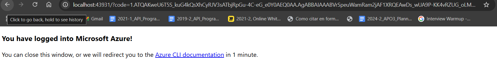

# Azure CLI & Kubernetes (AKS) Deployment

## Overview
This guide walks through setting up Azure CLI, Terraform, and deploying an Azure Kubernetes Service (AKS) cluster using Terraform. It also covers connecting to the cluster, deploying an Nginx service, monitoring with Lens, and cleaning up resources.

---

## Prerequisites
Ensure you have the following installed:
- [Azure CLI](https://learn.microsoft.com/es-es/cli/azure/install-azure-cli-linux?pivots=apt)
- Terraform
- Kubectl
- Minikube (if applicable)
- Lens (for monitoring)

---

## Step 1: Install Azure CLI
Follow the official [Azure CLI installation guide](https://learn.microsoft.com/es-es/cli/azure/install-azure-cli-linux?pivots=apt).
Verify installation using:
```sh
az --version
```


Verify the terraform installation
```sh
terraform -v
```

---

## Step 2: Log into Azure Student Account
1. Login using:
   ```sh
   az login
   ```
2. Verify the tenant (should be `Universidad Icesi`).
3. Set the active subscription:
   ```sh
   az account set --subscription "<subscription_id>"
   ```

Then we have to login into our Azure student account as we have credits they gift for students and verify that the Tenant is Universidad Icesi confirming that we succesfully logged.





---

## Step 3: Deploy AKS with Terraform
### Create a `main.tf` file


```hcl
provider "azurerm" {
  features {}
}

resource "azurerm_resource_group" "jm-first-rg" {
  name     = "jm-plataformas-first-rg"
  location = "East US"
}

resource "azurerm_kubernetes_cluster" "jmaks" {
  name                = "jm-plataformas-aks1"
  location            = azurerm_resource_group.jm-first-rg.location
  resource_group_name = azurerm_resource_group.jm-first-rg.name
  dns_prefix          = "jmpaks1"

  default_node_pool {
    name       = "default"
    node_count = 1
    vm_size    = "Standard_D2_v2"
  }

  identity {
    type = "SystemAssigned"
  }

  tags = {
    Environment = "Production-jm-plataformas"
  }
}
```
Over this terraform file we can use fmt to correct the format of the file like indentation.
And a terraform init to download all of the provider plugins


### Run Terraform Commands
```sh
terraform fmt    # Format configuration
terraform init   # Initialize Terraform
terraform plan   # Preview execution plan
terraform apply  # Deploy AKS
```
The init succesfully finishes.


We initialize the terraform plan to start the deployment in Azure by defining the execution plan.


Terraform apply to start the execution of the terraform plan.


We confirm the deployment.


Once deployed, verify resources in Azure in this case we just have an AKS and an RG.


---

## Step 4: Connect to AKS Cluster

As we need to connect with the Azure node we first  have to stop minikube and connect to the kubernetes cluster.

1. Stop Minikube (if running):
   ```sh
   minikube stop
   ```


2. Retrieve AKS credentials to run the cluster with kubectl:
   ```sh
   az aks get-credentials --resource-group jm-plataformas-first-rg --name jm-plataformas-aks1
   ```


3. Check active context:
   ```sh
   kubectl config current-context
   ```


---

## Step 5: Deploy Nginx Service
1. Create a pod with an Nginx container.
2. Expose it using a LoadBalancer service to get an external public IP:
   ```sh
   kubectl expose pod <pod-name> --type=LoadBalancer --port=80
   ```
3. Retrieve the external public IP and test in page:
   ```sh
   kubectl get services
   ```


---

## Step 6: Monitor Cluster with Lens
1. Use Lens for real-time monitoring.
2. If using WSL, configure a local proxy to access the Kubernetes API.
3. Load credentials into Lens manually by pasting the kubeconfig or selecting the file.


We will use Lens desktop for this but as we are running kubectl on WSL we need a local proxy to access the Kubernetes API from our windows environment.


We get the credentials and add them on Lens.


---

## Step 7: Cleanup
To remove all deployed resources and avoid charges:
```sh
terraform destroy
```


---

## Conclusion
This guide covers setting up Azure CLI, deploying an AKS cluster with Terraform, managing Kubernetes contexts, exposing services, monitoring with Lens, and cleaning up resources.
